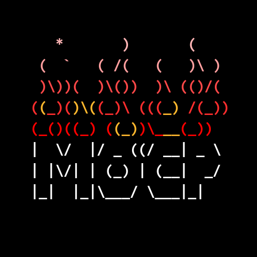

<center>
	
	<h2>Music on Console Player RPC</h2>
</center>

### Features
- [x] **Synchronized Timestamp**: Shows the current duration of the song in real-time.
- [x] **Multiple Theme Support**: Choose from different themes like "Default," "Wave," and "Fire."
- [x] **Metadata Display**: Detailed information about the currently playing track, such as artist, album, and duration.
- [x] **Discord Integration**: Automatic updates to your Discord status, showing what you're listening to.

<center>
    <div style="display: inline-block; text-align: center; margin: 10px;">
        <h4>Default</h4>
        
    </div>
    <div style="display: inline-block; text-align: center; margin: 10px;">
        <h4>Wave</h4>
        
    </div>
    <div style="display: inline-block; text-align: center; margin: 10px;">
        <h4>Fire</h4>
        
    </div>
</center>

### Install
The commands below are used to clone and configure mocp-discord-rpc on your Linux or macOS distribution.
```
$ git clone https://github.com/sychx/mocp-discord-rpc
$ cd mocp-discord-rpc && python3 pip install -r requirements.txt && cd ..
$ mkdir ~/.moc/plugins && mv mocp-discord-rpc/ ~/.moc/plugins/
$ python3 ~/.moc/plugins/mocp-discord-rpc/main.py
```
###### Note: Configure **mocp-discord-rpc** to start with the system, but if you don’t want to, I recommend setting up an alias in your `.bashrc` to start **mocp-discord-rpc** alongside **mocp**.

### License
```
MIT License

Copyright (c) 2024 sychx

Permission is hereby granted, free of charge, to any person obtaining a copy
of this software and associated documentation files (the "Software"), to deal
in the Software without restriction, including without limitation the rights
to use, copy, modify, merge, publish, distribute, sublicense, and/or sell
copies of the Software, and to permit persons to whom the Software is
furnished to do so, subject to the following conditions:

The above copyright notice and this permission notice shall be included in all
copies or substantial portions of the Software.

THE SOFTWARE IS PROVIDED "AS IS", WITHOUT WARRANTY OF ANY KIND, EXPRESS OR
IMPLIED, INCLUDING BUT NOT LIMITED TO THE WARRANTIES OF MERCHANTABILITY,
FITNESS FOR A PARTICULAR PURPOSE AND NONINFRINGEMENT. IN NO EVENT SHALL THE
AUTHORS OR COPYRIGHT HOLDERS BE LIABLE FOR ANY CLAIM, DAMAGES OR OTHER
LIABILITY, WHETHER IN AN ACTION OF CONTRACT, TORT OR OTHERWISE, ARISING FROM,
OUT OF OR IN CONNECTION WITH THE SOFTWARE OR THE USE OR OTHER DEALINGS IN THE
SOFTWARE.
```